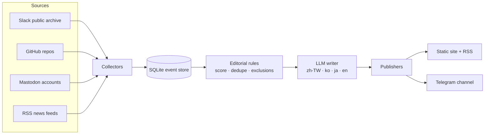

<p align="center"></p>

# rep0rter

**An AI reporter for the g0v civic-tech community.** Every hour it reads public
collaboration spaces (Slack, GitHub, Mastodon, RSS), picks what matters, writes a short
story in four languages, and publishes it to a website, RSS and Telegram.

- Site: https://rep0rter.observe.tw (English by default; 繁體中文 · 日本語 · 한국어 on request)
- Telegram: https://t.me/g0v_rep0rter
- License: CC0 1.0

## How it works



Every story links back to its source and ships with a source card (author, origin,
excerpt). Bots, CI noise and anyone who opts out are excluded before writing.
New Slack scoring rules run in shadow mode first and are promoted only after review.

The homepage, story pages, source pages and default RSS feed open in English.
Use the language links for Chinese, Japanese or Korean; old browser language
preferences do not redirect the homepage. Chinese uses `index.zh-TW.html` and
`feed.zh-TW.xml`. Existing `index.en.html` and `feed.en.xml` links remain available.
English pages show English report images and keep original text and excerpt cards
collapsed until opened. Missing translations display an explicit English pending
notice; they never substitute untranslated copy into the default edition.

## Run it

```sh
python3 -m venv .venv && . .venv/bin/activate
pip install -r requirements-dev.txt && playwright install chromium
cp .env.example .env            # Telegram + LLM settings; works without them

python -m rep0rter run --dry-run   # collect, select, preview; publishes nothing
python -m rep0rter run             # publish to Telegram and rebuild the site
python -m pytest -q tests
```

Other commands: `collect`, `report`, `build-site`, `translate`, `outbox`, `status`,
`loop --interval 3600`, `export`.

Production runs with `docker compose up -d --build`: a `worker` (hourly cycle),
`maintenance` (backups, health checks) and `web` (Caddy, static files on `127.0.0.1:18090`).

## Docs

- [Full documentation (繁體中文)](docs/README.zh-TW.md)
- [Collectors](docs/collectors.md) · [Editorial policy](docs/editorial-policy.md) ·
  [Stories & dedupe](docs/stories.md) · [Operations](docs/operations.md) ·
  [Telegram delivery](docs/telegram-delivery.md) · [FtO sources](docs/fto-sources.md)

## Contributing

Wanted: collaborators from Japan and Korea to curate sources and proofread the
ja/ko editions, frontend and design help, and feedback on the editorial rules.
Say hi in g0v Slack `#rep0rter`. To opt out of being reported, ask there too.
