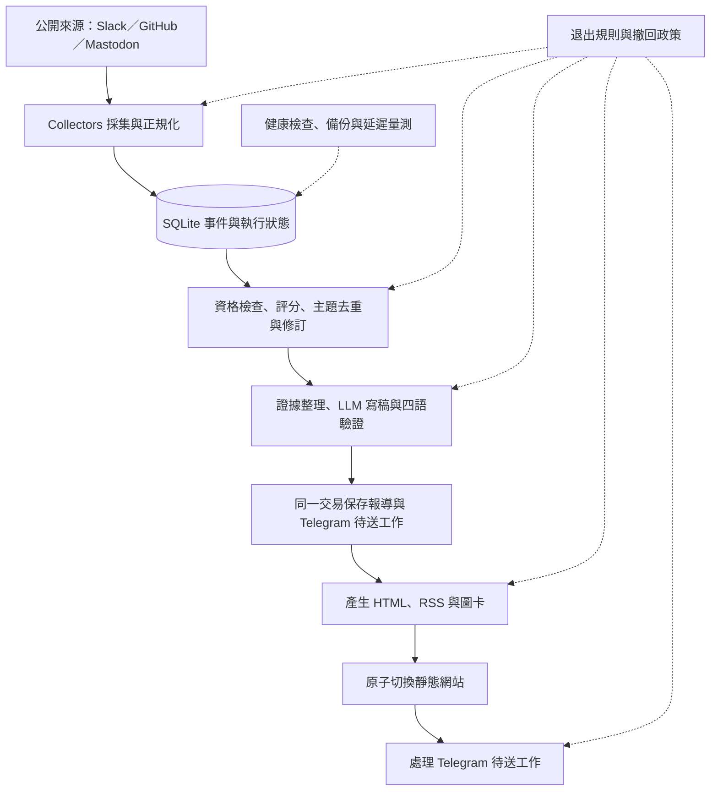

# rep0rter 專案總覽：架構、內容、樣式與維運

rep0rter 是報導 g0v、Code for Korea、Code for Japan 等公民科技社群的自動新聞系統：採集公開協作紀錄，挑選值得報導的進展，產生四語短報導，再發布到網站、RSS 與 Telegram。

本文件依 2026-09-19 本機 `PG` 分支、commit `d7d0008` 的程式與設定整理；套件自報版本為 `0.2.0`。正式站另以公開 HTTP GET 核對。下文分別標明本機實作、設定預設值與正式站觀察，正式環境的私有設定、資料庫及 Telegram 送達結果未在這次檢查。

後續網頁改版已整理在[清楚易讀的 Liquid Glass 介面](web-design.zh-TW.md)；本總覽保留改版前的視覺與程式規模快照。

## 1. 產品定位與技術組成

核心用途是讓社群成員快速知道「誰正在做什麼、有哪些活動或協作機會、去哪裡看原文」。讀者透過網站與訂閱接收消息；管理者透過 Python CLI 操作來源、翻譯、退出、發布恢復與備份。

| 面向 | 本機實作 |
|---|---|
| 執行環境 | Python；Docker 與 CI 指定 Python 3.12 |
| 資料與採集 | SQLite、Requests、Beautiful Soup；以事件為共同資料格式 |
| 寫稿 | 可設定的 OpenAI 相容 Chat Completions HTTP 端點；規則選稿與四語輸出驗證 |
| 網站與圖卡 | Jinja2 靜態 HTML、原生 CSS／JavaScript；Playwright Chromium 截圖，Pillow 作備援 |
| 發布與維運 | Telegram Bot API、RSS、Docker Compose、Caddy；文件描述以 Cloudflare Tunnel 對外 |

目前本機網站由靜態檔案構成，瀏覽器端 JavaScript 只增強語言切換時的閱讀位置。原始碼採 CC0 1.0，依賴版本範圍見 [requirements.txt](../requirements.txt)，開發依賴見 [requirements-dev.txt](../requirements-dev.txt)。

## 2. 架構、目錄與資料流



圖中的順序對應一般 `run`：先採集、選稿與保存，再建站，最後處理 Telegram 與遠端撤回。補缺翻譯在建站前執行。網站發布與 Telegram 送達各自留存狀態；網站更新成功不代表訊息已送達。

```text
rep0rter/
├── README.md                   英文入口
├── docs/                       中文入口與各子系統文件
├── rep0rter/
│   ├── __main__.py、cli.py      指令入口與排程流程
│   ├── config.py               環境變數與預設值
│   ├── collectors/             Slack、GitHub、Mastodon 採集
│   ├── store.py                SQLite schema 與資料存取
│   ├── sources.py              來源正規化與自動通知排除
│   ├── editorial.py            評分、影子觀察、人工標籤與回放
│   ├── stories.py              同主題辨識、跨貼去重與修訂
│   ├── reporter.py             候選挑選、寫稿與補譯
│   ├── writer_contract.py      證據、輸出契約、驗證與備援
│   ├── llm.py                  模型 HTTP 客戶端
│   ├── publishers/             site.py、cards.py、telegram.py
│   ├── delivery.py             持久化 Telegram 待送佇列
│   ├── policy.py               退出規則、不可復活記錄與本機清除
│   ├── retractions.py          Telegram 撤回與訊息對應
│   ├── republish.py            既有 Telegram 內容的英文替換批次
│   ├── operations.py           備份、還原演練、健康與量測
│   ├── i18n.py                 語言路徑與介面文案
│   └── templates/             網頁、圖卡、RSS 與樣式
├── assets/logo.png             品牌圖像
├── tests/                      離線測試與合成資料
└── compose.yaml、Dockerfile、Caddyfile
```

本機盤點有 30 個應用程式 Python 檔，約 6,164 行；`tests/` 有 24 個 Python 檔，約 4,368 行。行數包含空白與註解。

| 子系統 | 主要責任與檔案 |
|---|---|
| 採集 | [registry.py](../rep0rter/collectors/registry.py) 分配請求額度並隔離來源錯誤；`slack_incremental.py` 處理續掃、重疊回掃與 root 刷新；`slack_content.py` 還原附件與引用 |
| 編輯 | [editorial.py](../rep0rter/editorial.py)、[stories.py](../rep0rter/stories.py)、[reporter.py](../rep0rter/reporter.py) 決定值得報導的主題及更新 |
| 寫稿 | [writer_contract.py](../rep0rter/writer_contract.py) 保存可追溯證據與驗證結果；[llm.py](../rep0rter/llm.py) 只負責模型呼叫 |
| 發布 | [site.py](../rep0rter/publishers/site.py) 產出網站；[cards.py](../rep0rter/publishers/cards.py) 產圖；[delivery.py](../rep0rter/delivery.py) 管理送達狀態 |
| 政策與維運 | [policy.py](../rep0rter/policy.py)、[retractions.py](../rep0rter/retractions.py)、[republish.py](../rep0rter/republish.py)、[operations.py](../rep0rter/operations.py) |

資料模型必須區分 `Event`、`Story`、`Post`：一筆 Event 是觀察到的來源紀錄；同一件事的多筆 Event 可以歸入一個 Story；Story 的實質更新可形成多篇具有不同永久 ID 的 Post。跨貼不必重發，取消、截止變更或重要更正則可產生新修訂。

| 資料群 | 資料表與用途 |
|---|---|
| 來源 | `containers`、`users`、`events`：來源空間、作者、文字、時間、回覆與互動 |
| 報導與主題 | `posts`、`stories`、`story_events`、`story_posts`：四語文字、來源關係、主題版本 |
| 編輯稽核 | `editorial_decisions`、`writer_audits`：評分、選擇、證據、模型結果與待審原因 |
| 發布與撤回 | `delivery_jobs`、`telegram_mutations`、`telegram_republish_batches`、`retractions`：待送、遠端修改與批次恢復 |
| 執行與政策 | `runs`、`kv`、`policy_rules`、`event_tombstones`：排程、游標、健康狀態及退出防復活記錄 |

SQLite 使用 WAL；部分子系統按需初始化自己的資料表。退出政策另存於 `data/exclusions.json`，還原舊資料庫時仍須保留最新政策。完整背景見 [主題與修訂](stories.md)、[來源採集](collectors.md)。

## 3. 內容、頁面與讀者流程

Slack 使用 g0v 公開存檔；GitHub 及 Mastodon 必須明列允許來源，範例設定預設留空。GitHub adapter 支援 release、協作 issue 與符合資格的人工 PR；Mastodon adapter 處理允許帳號的公開貼文。FtO 文件提供日韓來源候選，但本機文件不能證明正式環境設定了哪些來源。

內容偏向活動、招募、協作、開源成果與公民科技進展。bot、CI、依賴更新及例行維護會被篩除；來源通過資格檢查後仍須經選稿與寫稿驗證。

| 頁面／輸出 | 組成與路徑 |
|---|---|
| 首頁 | 品牌、定位文案、語言切換、訂閱入口、依日期分組的報導卡、更新狀態；`index.html` 等四語版本，最多列最近 300 篇 |
| 單篇報導 | `posts/<post-id>/index[.語言].html`；永久網址、原文、報導時間、來源與修訂導覽 |
| 來源頁 | `sources/<source-hash>/index[.語言].html`；集中呈現同一來源空間的報導 |
| RSS 與圖卡 | 四語 `feed[.語言].xml`；圖卡位於 `cards/`，可下載與用於 Telegram |
| 撤回頁 | 原永久網址保留四語撤回告示；移除原內容及個人資訊 |

英文使用無語言後綴的 `index.html`／`feed.xml`；繁中為 `.zh-TW`、日文 `.ja`、韓文 `.ko`。舊 `.en` 網址保留相容別名。超過首頁 300 篇視窗的舊文章仍有永久頁與來源頁。

每張報導卡包含來源名稱、標題、摘要、圖卡、作者、原文時間、互動數與來源連結；原文放在可展開區塊。單篇頁額外顯示報導時間、版本與相關來源。英文版使用英文摘要圖卡，原文圖卡放在展開區域；其他語言版沿用原文圖卡。

四語文字的契約是標題最多 30 個 Unicode code point、摘要最多 90 個，空格計入。日期、參與連結、證據 ID、來源歸屬、閉門限制與不確定語氣有專門驗證；模型寫稿至多一次重試。安全摘錄仍無法成立時，內容留待審查。

缺少英文翻譯時，英文頁顯示待翻譯提示；其他語言頁可以顯示已保存文字並標註缺譯。Telegram 缺少指定語言時維持待送。補譯不改變原發布時間、RSS GUID 或既有送達紀錄。更改語言使用真正的頁面連結，JavaScript 以文章錨點保留閱讀位置；回首頁仍預設英文。

**正式站額外觀察：** [首頁](https://rep0rter.observe.tw/) 已有「Post your project」入口；[投稿頁](https://rep0rter.observe.tw/submit) 公開畫面顯示 Google 登入及自動專案新聞管理入口。本機 checkout 沒有對應投稿頁、Google 登入處理或動態服務設定。僅確認了公開頁面可讀取，未登入、投稿或驗證管理功能；這部分應在找到實際部署程式後補上架構圖。

介面文案見 [i18n.py](../rep0rter/i18n.py)，頁面結構見 [index.html](../rep0rter/templates/index.html)，選稿與寫稿規則見 [編輯政策](editorial-policy.md)。

## 4. 視覺樣式與修改位置

目前是偏社群刊物的單欄卡片版面：米白背景、深綠文字、白色卡片、柔和邊框與圓角。Logo 是米白底、深色／灰色／紅色同心圓與斜向線段的圖案；頁首以圓形裁切呈現。品牌 Logo 用於站台識別，來源頭貼與來源 Logo 則獨立呈現。

| 色彩角色 | 淺色模式 | 深色模式 |
|---|---|---|
| 背景／卡片 | `#f5f6f1`／`#ffffff` | `#151c18`／`#202922` |
| 主文字 | `#25362c` | `#e8efe6` |
| 次要文字 | `#65716a` | `#a5b2a8` |
| 強調色／淡色底 | `#386947`／`#e5efd9` | `#b5d49e`／`#33452b` |
| 分隔線 | `#dfe5d9` | `#364439` |

| 規格 | 目前設定 |
|---|---|
| 版寬與留白 | 容器最大 `52rem`，以 16px 根字級換算為 832px，包含內距；一般水平內距 `1.5rem` |
| 字體與字級 | 系統無襯線＋Noto CJK 備援；正文 16px、行高 1.75；頁首標題 `clamp(1.6rem, 4vw, 2.2rem)`；文章標題 `1.3rem` |
| 卡片與導覽 | 文章卡片 18px 圓角、1px 邊框；語言按鈕膠囊形狀；日期以等寬字與篇數標籤呈現 |
| 手機與主題 | 480px 以下縮減頁面與卡片內距；依系統 `prefers-color-scheme` 切換深淺色 |
| 可讀性 | 圖片維持比例且延遲載入、長字串換行、韓文保留詞組、鍵盤焦點外框、語言與目前頁面標記 |

圖卡固定 1200×630 PNG。原文圖卡放作者／來源頭貼、原文摘錄、時間及來源網址；英文圖卡增加標題與摘要，明確標示 `ENGLISH REPORT` 與 `Summary by rep0rter`。渲染時使用本機 HTML，禁止渲染頁連外；頭貼另以受限的公開 HTTPS 下載流程取得。沒有頭貼則顯示名字首字，Chromium 不可用時使用 Pillow 備援。圖卡本身使用固定淺色配色。

| 想修改的項目 | 修改位置 |
|---|---|
| 網站配色、字體、間距與 RWD | [style.css](../rep0rter/templates/style.css) |
| 頁首、文章卡片、頁尾與閱讀資訊 | [index.html](../rep0rter/templates/index.html)；資料組裝在 [site.py](../rep0rter/publishers/site.py) |
| 四語介面文案與語言切換 | [i18n.py](../rep0rter/i18n.py)、[language.js](../rep0rter/templates/language.js) |
| 原文／英文圖卡排版 | [card.html](../rep0rter/templates/card.html)、[report-card.html](../rep0rter/templates/report-card.html)；Pillow 備援在 [cards.py](../rep0rter/publishers/cards.py) |
| 品牌、分享預覽與 RSS | [logo.png](../assets/logo.png)、[site.py](../rep0rter/publishers/site.py)、[feed.xml](../rep0rter/templates/feed.xml) |

正式站 CSS 保留本機的基礎版面，額外增加投稿表單、登入按鈕及帳號區塊樣式。本次以程式、正式 HTML／CSS 及 Logo 圖檔核對樣式；沒有可用瀏覽器連線，因此尚未完成桌機／手機截圖及互動驗收。

## 5. 執行、維運與本次整理結果

預設每輪採集最近 2 天資料，候選窗口為 48 小時，選稿門檻 6，每輪最多 5 則。Compose 的 worker 每輪結束後等待 3,600 秒，因此並非固定整點觸發。採集 HTTP 額度預設每輪 80、每日 1,500 次；這不是 LLM 費用預算。

新 Slack 評分預設 `shadow`：保存新舊評分及證據，同時沿用基準排序並套用硬性排除。需要至少兩週觀察與人工評估，再決定是否切換 `active`；文件與測試不能代替這段實際觀察。詳見 [實作紀錄](implementation-notes.md)。

| 操作 | 指令與影響；均從專案根目錄執行 |
|---|---|
| 採集／預覽 | `python -m rep0rter collect`；`python -m rep0rter run --dry-run --no-llm`。會採集、寫入資料與稽核，預覽不建立報導／待送工作或推播 |
| 完整發布 | `python -m rep0rter run`；`report` 則使用已存資料選稿、建站並處理待送 |
| 重建／補譯 | `python -m rep0rter build-site`；`python -m rep0rter translate --limit 10`。補譯可能呼叫模型，這兩種操作不重送 Telegram |
| 檢查／恢復 | `python -m rep0rter outbox`、`health`、`metrics`；`health` 與 `metrics` 以唯讀方式檢查資料庫 |
| 備份／退出 | `python -m rep0rter backup`；`exclusion`、`retract`、`retraction-delivery` 分別管理退出、本機清除與遠端撤回，細節依操作文件 |

Compose 包含 `worker`、`maintenance`、`web` 三個服務。Caddy 提供 `/data/site` 靜態檔，主機只綁定 `127.0.0.1:18090`。Tunnel 由部署端另外管理，未包含在這份 Compose。`data/` 保存 SQLite、圖卡快取、站台版本、政策與備份；本機 checkout 目前沒有執行期 `data/` 或 `.env`。

站台先完整生成至 `.site-releases/`，再切換 `site` 符號連結；Telegram 採持久化 outbox，狀態為 `prepared`、`sending`、`sent`、`failed`、`unknown`。送達不明時需要人工核對，不會自動盲目重送。測試模式沒有測試 chat 時不回退正式頻道。

維運預設保留 7 份每日、4 份每週本機備份，包含完整性與 checksum 驗證，另有還原演練。異地備份可選；管理告警需要獨立目的地及啟用設定。這些是本機程式與設定能力，未透過正式主機驗證目前是否成功執行。詳見 [維運](operations.md)、[Telegram 發布與恢復](telegram-delivery.md)。

| 本次檢查 | 結果與邊界 |
|---|---|
| 原始碼 | 54 個 Python 檔可通過本機 Python 3.14 的 AST 語法解析；這不是 Python 3.12 相容性或功能測試 |
| 測試資產 | 盤點 23 個 `test_*.py`、276 個測試函式，另有 `conftest.py`；本機缺少 pytest 與執行依賴，未執行測試套件 |
| CI 設定 | 有 Python 3.12 push／PR 離線測試 workflow；測試停用 dotenv 與網路 transport，遠端 CI 實際結果未查核 |
| 正式公開輸出 | 英文首頁、繁中首頁、CSS、英文 RSS 與投稿頁皆取得 HTTP 200；RSS 可解析。這不代表排程、登入或推播已驗收 |
| 文件整理 | 新增這份總覽並從中文入口連入；修正中文入口 7 個多帶 `docs/` 前綴的相對連結；應用程式與樣式未修改 |

接續維護時，依目前證據排序的五件事：

1. **先對齊正式站與本機版本。** 找到投稿、Google 登入及專案管理的實際程式與部署設定；本機目前的純靜態部署描述未涵蓋它們。
2. **補上可重現的驗證環境。** 使用專案設定的 Python 3.12 安裝開發依賴並跑既有測試，記錄實際結果；目前只能確認語法與測試資產存在。
3. **完成四語視覺驗收。** 核對手機、深色模式、長原文、缺譯與修訂情境，以及英文與 CJK 圖卡是否截斷重要資訊。
4. **持續人工檢視選稿與翻譯。** 30／90 字元限制對英文尤其緊，結構驗證也不能證明所有翻譯語意正確；維持影子觀察及可追溯證據。
5. **集中後續維護規格。** 網站 CSS、兩份圖卡 CSS 與 Pillow 備援各有樣式數值；未來改版宜一併核對。設定也分散於 `Config` 與直接讀取環境變數的模組，可逐步整理。

下一步（約 1 分鐘）：先看第 2 節架構圖，再用第 4 節「修改位置」表定位你要調整的畫面。
